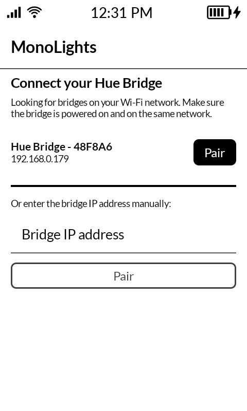
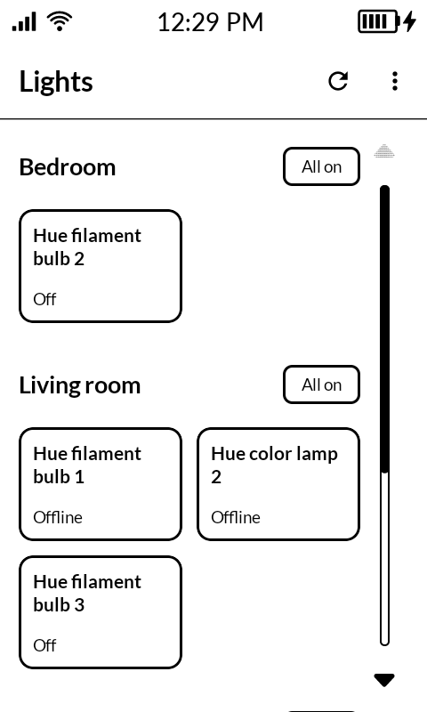
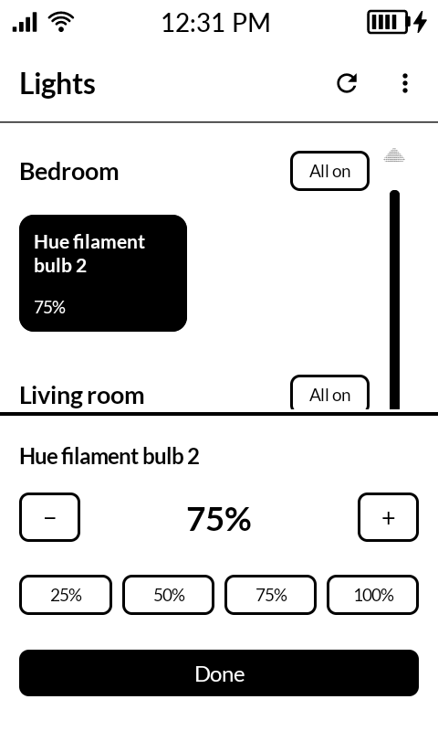

# MonoLights

MonoLights turns your phone into a simple remote for Philips Hue lights. It is built for the Mudita Kompakt e-ink phone with MMD (Mudita Mindful Design): black and white, no animations, no clutter.

Everything happens on your own Wi-Fi network. The app talks directly to the Hue Bridge in your home and never contacts Philips, Mudita, or any other server on the internet. Nothing is tracked and nothing leaves your house.

  
  
  

## Install

Download the latest APK from the [releases page](../../releases) and sideload it,
or build from source:

    ./gradlew installDebug

## How it works

The first time you open the app it searches your Wi-Fi network for a Hue Bridge. Pick your bridge (or type its IP address), then press the round button on the bridge itself to confirm the pairing. The bridge remembers the app from then on.

After that every room shows its lights as big tiles, two per row. Tap a tile to switch that light on or off; a light that is on shows as a solid black tile with its brightness. Hold a tile to change the brightness with plus and minus buttons or a preset. Each room also has a button to switch everything in it on or off at once.

Use the menu in the top right to forget the bridge and pair again.

## Privacy

The app needs network access for exactly one thing: talking to the Hue Bridge over your local network. The bridge is found with local discovery (mDNS) and controlled through its local API. No accounts, no cloud, no analytics. The only thing stored on the phone is the bridge's IP address and the pairing key the bridge hands out.

## Structure

- `app/src/main/java/com/monoapps/monolights/MainActivity.kt`: entry point, switches between setup and the main screen.
- `app/src/main/java/com/monoapps/monolights/LightsViewModel.kt`: app state, pairing flow, and all bridge commands.
- `app/src/main/java/com/monoapps/monolights/api/HueApi.kt`: small client for the bridge's local REST API.
- `app/src/main/java/com/monoapps/monolights/api/HueDiscovery.kt`: finds bridges on the network via mDNS.
- `app/src/main/java/com/monoapps/monolights/ui/SetupScreen.kt`: bridge discovery and link-button pairing.
- `app/src/main/java/com/monoapps/monolights/ui/HomeScreen.kt`: app frame around the lights grid.
- `app/src/main/java/com/monoapps/monolights/ui/LightsTab.kt`: light tiles per room and the brightness sheet.

## Support

If you find this app useful, consider [sponsoring me](https://github.com/sponsors/berendsliedrecht).

## License

[MIT](LICENSE)
